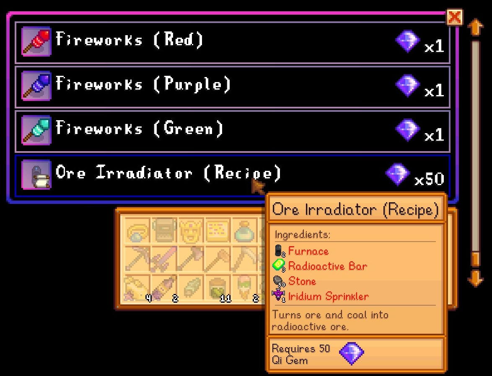
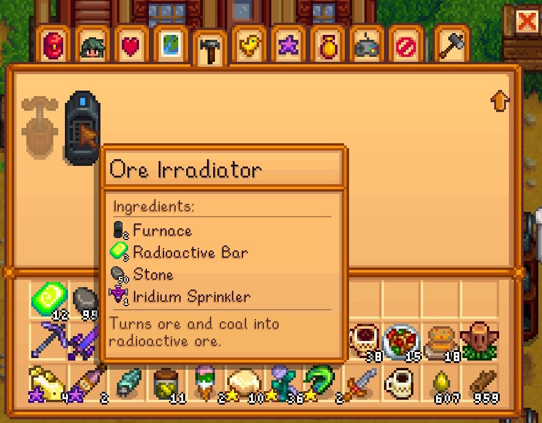
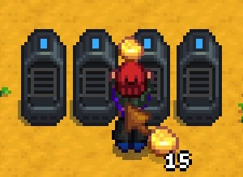
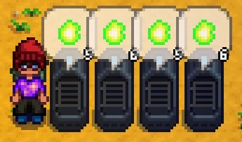

* Buy "Ore Irradiator" recipe from Qi's Walnut Room stock;  

* Craft "Ore Irradiator";  

* Place "Ore Irradiator" somewhere and put some ore with coal in it;  

* Wait some time and pick up the radioactive ore  


```
For 4-6 radioactive ore you need 25/20/15/10 copper/iron/gold/irridium ores and 1 coal.
```

# Credits
Thanks to [vin163](https://www.nexusmods.com/stardewvalley/users/8195331) for providing the French translation